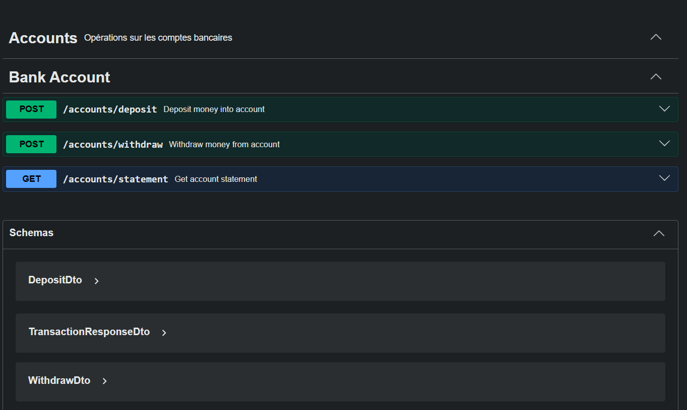

#  Bank Account 

> Implémentation d'un système de gestion de compte bancaire avec transaction immuable et architecture hexagonale/DDD.



## Objectif

Système bancaire respectant strictement l'interface imposée avec :
- Transaction immuable (Value Object)
- Validation métier rigoureuse
- Traçabilité complète des opérations
- Architecture testable et maintenable

## Quick Start

```bash
# Installation
npm install

# Lancer les tests unitaires
npm run test

# Lancer les tests e2e
npm run test:e2e

# Démarrer l'application
npm run start:dev

# Accéder à la documenttation de l'api ici
open http://localhost:3000/api
```

## API Documentation

L'application génère automatiquement une documentation Swagger interactive.

**URL** : http://localhost:3000/api

### Endpoints Disponibles

| Méthode | URL | Description |
|---------|-----|-------------|
| POST | `/accounts/deposit` | Effectuer un dépôt |
| POST | `/accounts/withdraw` | Effectuer un retrait |
| GET | `/accounts/statement` | Consulter le relevé |

### Exemples

```bash
# Dépôt de 1000 fr
curl -X POST http://localhost:3000/accounts/deposit \
  -H "Content-Type: application/json" \
  -d '{"amount": 1000}'

# Retrait de 500 fr
curl -X POST http://localhost:3000/accounts/withdraw \
  -H "Content-Type: application/json" \
  -d '{"amount": 500}'

# Consulter le relevé
curl http://localhost:3000/accounts/statement
```

## Architecture

```
src/
├── domain/              # Cœur métier (indépendant)
│   ├── entities/        # Transaction (immuable)
│   ├── exceptions/      # Erreurs métier typées
│   └── interfaces/      # BankAccount (interface imposée)
│
├── application/         # Logique applicative
│   ├── services/        # BankAccountService
│   └── ports/           # Interfaces (Repository, DateProvider)
│
├── infrastructure/      # Implémentation technique
│   └── repositories/    # InMemoryTransactionRepository
│
└── presentation/        # API REST
    ├── controllers/     # Endpoints HTTP
    └── dto/             # Validation des entrées
```

## Règles Métier

### Dépôts
-  Montant strictement positif (> 0)
-  Limite : 1 000 000 € par opération
-  Mise à jour automatique du solde

### Retraits
-  Montant strictement positif (> 0)
-  Solde suffisant obligatoire (pas de découvert)
-  Limite : 1 000 000 € par opération

### Relevé
-  Ordre chronologique décroissant (plus récent en premier)
-  Format : Date | Type | Montant | Solde
-  Cohérence des soldes garantie

## Tests

```bash
# Tests unitaires
npm test

# Tests avec couverture
npm run test:cov

# Tests en mode watch
npm run test:watch

# Tests E2E
npm run test:e2e
```

## Stockage

**En mémoire** : Les transactions sont stockées dans une `Map<accountId, Transaction[]>`

⚠️ **Données perdues au redémarrage** : Volontaire pour simplifier les tests


Grâce à l'abstraction par interface, le reste du code reste inchangé.

## Stack Technique

**Backend** : NestJS • TypeScript  
**Tests** : Jest • Supertest  
**Architecture** : DDD • Hexagonale • Clean Architecture  
**Outils** : ESLint • Prettier • Swagger • Git  
**Patterns** : Immutabilité • Repository • Dependency Injection


Pour simuler un compte unique, utilisez toujours le même ID (ex: `"default"`).

### Stockage en Mémoire
- **Simplicité** : Pas de configuration externe
- **Performance** : Accès instantané
- **Tests** : Isolation parfaite entre les tests
- **Production** : Remplacement facile via injection de dépendances


### Long terme
- [ ] Architecture microservices
- [ ] Event streaming (Kafka)
- [ ] GraphQL API

## Auteur
Nom:  Yeo pevrogui noel
EMAIL: yeopevroguinoel@gmail.com 
